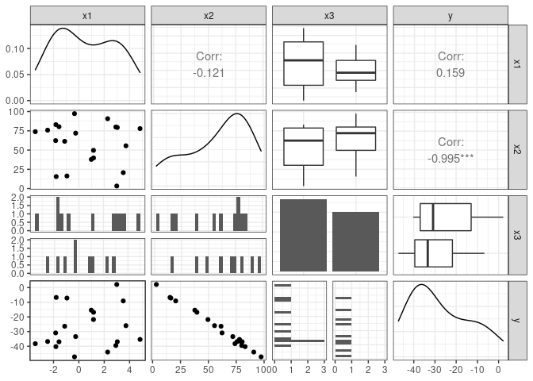
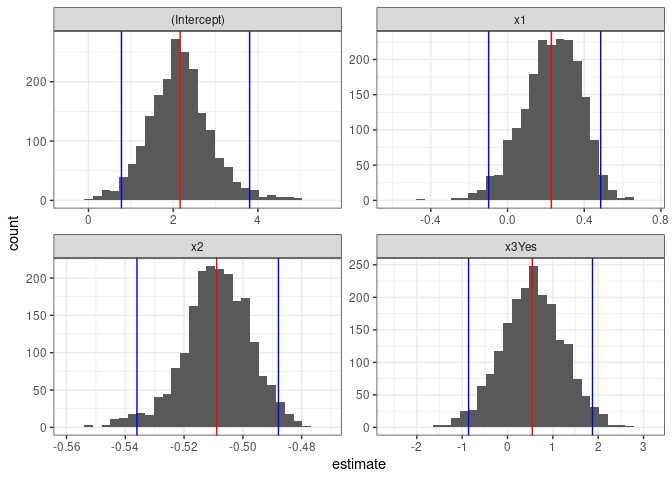

Activity 9 - Bootstrapping
================

### Libraries

``` r
library(tidyverse)
library(tidymodels)
library(GGally)
```

### Create the Data

``` r
# Create a data frame/tibble named sim_dat
sim_dat <- tibble(
# Create 20 values that are uniformly distributed between -5 and 5
  x1 = runif(20, -5, 5),
# Create 20 values that are uniformly distributed between 0 and 100
  x2 = runif(20, 0, 100),
# Create 20 values using the Bernoulli distribution (coin flip)
  x3 = rbinom(20, 1, 0.5)
  )

b0 <- 2
b1 <- 0.25
b2 <- -0.5
b3 <- 1
sigma <- 1.5

errors <- rnorm(20, 0, sigma)

sim_dat <- sim_dat %>% 
  mutate(
    y = b0 + b1*x1 + b2*x2 + b3*x3 + errors,
    x3 = case_when(
      x3 == 0 ~ "No",
      TRUE ~ "Yes"
      )
    )
```

The baseline model is `y = b0 + b1*x1 + b2*x2 + b3*x3` prior to the
mutation where we introduce normalized errors using the `sigma` value.

### Visualize Variable Pairs

``` r
sim_dat %>% 
  ggpairs() + 
  theme_bw()
```

<!-- -->

### Traditional MLR Model

``` r
mlr_fit <- linear_reg() %>%
  set_mode("regression") %>% 
  set_engine("lm") %>% 
  fit(y ~ x1 + x2 + x3, data = sim_dat)

# Also include the confidence intervals for our estimated slope parameters
mlr_summary <- tidy(mlr_fit, conf.int = TRUE)
mlr_summary
```

    ## # A tibble: 4 × 7
    ##   term        estimate std.error statistic  p.value conf.low conf.high
    ##   <chr>          <dbl>     <dbl>     <dbl>    <dbl>    <dbl>     <dbl>
    ## 1 (Intercept)    2.11     0.776      2.72  1.50e- 2   0.469      3.76 
    ## 2 x1             0.244    0.134      1.82  8.70e- 2  -0.0396     0.527
    ## 3 x2            -0.508    0.0118   -43.3   5.27e-18  -0.533     -0.483
    ## 4 x3Yes          0.491    0.641      0.767 4.54e- 1  -0.867      1.85

Comparing the estimates for the intercept and `x` variables. I see that
the MLR model has a y-intercept of 2.25 instead of 2. An `x1`
coefficient of .1 instead of 0.25, matching `x2` coefficients, and `x3`
coefficient of .9 instead of 1.

### Bootstrapping

``` r
# Set a random seed value so we can obtain the same "random" results
set.seed(631)

# Generate the 2000 bootstrap samples
boot_samps <- sim_dat %>% 
  bootstraps(times = 2000)

boot_samps
```

    ## # Bootstrap sampling 
    ## # A tibble: 2,000 × 2
    ##    splits          id           
    ##    <list>          <chr>        
    ##  1 <split [20/8]>  Bootstrap0001
    ##  2 <split [20/6]>  Bootstrap0002
    ##  3 <split [20/6]>  Bootstrap0003
    ##  4 <split [20/6]>  Bootstrap0004
    ##  5 <split [20/10]> Bootstrap0005
    ##  6 <split [20/10]> Bootstrap0006
    ##  7 <split [20/7]>  Bootstrap0007
    ##  8 <split [20/6]>  Bootstrap0008
    ##  9 <split [20/8]>  Bootstrap0009
    ## 10 <split [20/6]>  Bootstrap0010
    ## # … with 1,990 more rows

### Fit MLR to Bootstraps

``` r
# Create a function that fits a fixed MLR model to one split dataset
fit_mlr_boots <- function(split) {
  lm(y ~ x1 + x2 + x3, data = analysis(split))
}

# Fit the model to each split and store the information
# Also, obtain the tidy model information
boot_models <- boot_samps %>% 
  mutate(
    model = map(splits, fit_mlr_boots),
    coef_info = map(model, tidy)
    )

boots_coefs <- boot_models %>% 
  unnest(coef_info)

boots_coefs
```

    ## # A tibble: 8,000 × 8
    ##    splits         id            model  term    estim…¹ std.e…² statis…³  p.value
    ##    <list>         <chr>         <list> <chr>     <dbl>   <dbl>    <dbl>    <dbl>
    ##  1 <split [20/8]> Bootstrap0001 <lm>   (Inter…  2.87   0.694     4.13   7.88e- 4
    ##  2 <split [20/8]> Bootstrap0001 <lm>   x1      -0.0503 0.143    -0.350  7.31e- 1
    ##  3 <split [20/8]> Bootstrap0001 <lm>   x2      -0.507  0.0107  -47.5    1.19e-18
    ##  4 <split [20/8]> Bootstrap0001 <lm>   x3Yes    0.0473 0.709     0.0666 9.48e- 1
    ##  5 <split [20/6]> Bootstrap0002 <lm>   (Inter…  2.18   0.635     3.43   3.43e- 3
    ##  6 <split [20/6]> Bootstrap0002 <lm>   x1       0.168  0.143     1.17   2.57e- 1
    ##  7 <split [20/6]> Bootstrap0002 <lm>   x2      -0.501  0.00907 -55.2    1.08e-19
    ##  8 <split [20/6]> Bootstrap0002 <lm>   x3Yes   -0.198  0.623    -0.319  7.54e- 1
    ##  9 <split [20/6]> Bootstrap0003 <lm>   (Inter…  1.40   0.826     1.70   1.08e- 1
    ## 10 <split [20/6]> Bootstrap0003 <lm>   x1       0.246  0.119     2.06   5.60e- 2
    ## # … with 7,990 more rows, and abbreviated variable names ¹​estimate, ²​std.error,
    ## #   ³​statistic

### Estimates using 95% Confidence Interval

``` r
boot_int <- int_pctl(boot_models, statistics = coef_info, alpha = 0.05)
boot_int
```

    ## # A tibble: 4 × 6
    ##   term         .lower .estimate .upper .alpha .method   
    ##   <chr>         <dbl>     <dbl>  <dbl>  <dbl> <chr>     
    ## 1 (Intercept)  0.779      2.17   3.81    0.05 percentile
    ## 2 x1          -0.0987     0.229  0.486   0.05 percentile
    ## 3 x2          -0.536     -0.509 -0.488   0.05 percentile
    ## 4 x3Yes       -0.859      0.547  1.87    0.05 percentile

### Variability of Estimates

``` r
ggplot(boots_coefs, aes(x = estimate)) +
  geom_histogram(bins = 30) +
  facet_wrap( ~ term, scales = "free") +
  geom_vline(data = boot_int, aes(xintercept = .lower), col = "blue") +
  geom_vline(data = boot_int, aes(xintercept = .upper), col = "blue") +
  geom_vline(data = boot_int, aes(xintercept = .estimate), col = "red") +
  theme_bw()
```

<!-- -->

Comparing the estimates for the intercepts and `x` variables. I see that
the MLR model using bootstrapping has a y-intercept of 2.25 instead of
2. An `x1` coefficient of .09 instead of 0.25, matching `x2`
coefficients, and matching `x3` coefficients.

Comparing against the MLR model that didn’t use bootstrapping, the
intercept and coefficient for `x3` was closer to the population model in
the bootstrapping model, but the coefficient for `x1` was farther away.

### Challenge: Comparison Lines

``` r
ggplot(boots_coefs, aes(x = estimate)) +
  geom_histogram(bins = 30) +
  facet_wrap( ~ term, scales = "free") +
  geom_vline(data = boot_int, aes(xintercept = .lower), col = "blue") +
  geom_vline(data = boot_int, aes(xintercept = .upper), col = "blue") + 
  geom_vline(data = mlr_summary, aes(xintercept = conf.low), col = "red") +
  geom_vline(data = mlr_summary, aes(xintercept = conf.high), col = "red") +
  theme_bw()
```

<!-- -->
